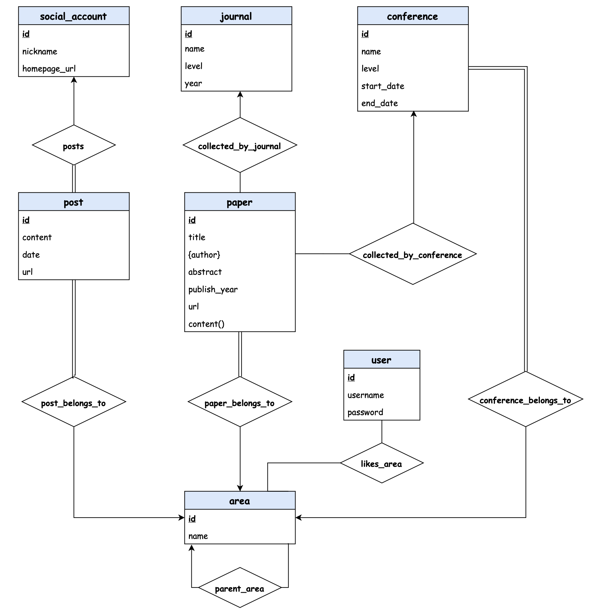

# Trends

> Research trends management system.

This is a showcase app for the database course project which leverages SwiftUI for UI development and Core Data for data persistency. The introductory slides can be found [here](Presentation.pdf).

## Database design: the E-R diagram

The implementation is based on the following E-R diagram:

